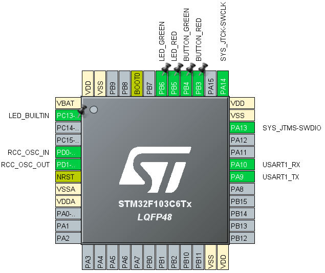

# dessuite

Conjunto de ferramentas para trabalhar com Sistemas a Eventos Discretos (DES, _Discrete Event Systems_).

## Instalação

Verifique que o [Python 3.14.3 ou superior](https://www.python.org/) esteja instalado, e que o comando `pip` ou `python` estejam disponíveis no terminal.

[Clone o repositório](https://docs.github.com/en/repositories/creating-and-managing-repositories/cloning-a-repository) através do terminal usando o git ou através do navegador. Então, navegue para o diretório do repositório e instale o módulo dessuite usando o pip:

```shell
git clone https://github.com/klement01/dessuite
cd dessuite
pip install .
# Alternativa: python -m pip install .
```

Após instalar o módulo, o comando `dessuite` deve ficar disponível no terminal.

## Ferramentas

Após instalar o módulo dessuite, as ferramentas descritas abaixo devem ficar disponíveis no terminal através do comando `dessuite`, no formato:

```shell
dessuite {'nome do comando'} ['argumentos'...]
```

### dessuite controller

Controla uma planta do [FlexFact](https://fgdes.tf.fau.de/flexfact.html) usando controladores especificados como Autômatos Finitos Determinísticos (DFA, _Deterministic Finite Automata_) ou Redes de Petri. Se comunica com a planta usando Modbus/TCP.

O comando `dessuite controller` requer como entradas:

- Um arquivo _Modbus Device File_ (**.dev**) gerado pelo FlexFact. Este arquivo define o protocolo de comunicação utilizado entre o FlexFact e o dessuite.
    - Para gerar este arquivo, abra o arquivo da planta a ser controlada (.ffs) no FlexFact e selecione "File" → "Export Modbus/TCP configuration".
- Um ou mais arquivos de especificação de controladores. Os formatos aceitos são:
    - **.gen**: DFA; gerado pelo FAUDES/DESTool.
    - **.net**: Rede de Petri; gerado pelo Tina Toolbox.
        - Para gerar este arquivo, abra o arquivo gráfico do Tina Toolbox (.ndr) da Rede de Petri a ser usada e selecione "Edit" → "textify".

Caso sejam especificados múltiplos controladores (DFAs e/ou Redes de Petri), os controladores são executados em paralelo seguindo a metodologia de controle supervisório modular local. Veja ["Controle supervisório modular de sistemas de manufatura" por Max H. de Queiroz, José E. R. Cury (2002)](https://www.scielo.br/j/ca/a/CmNVyYqYLMHkcGyMzjkfDTG/?lang=pt) para mais informações.

#### Exemplo

Para controlar uma planta usando uma Rede de Petri:

1. Siga os passos acima para gerar o arquivo **.dev** e o arquivo **.net**.
1. No FlexFact, selecione "Simulation" → "Modbus" para selecionar o protocolo de comunicação Modbus.
1. No FlexFact, selecione "Start" para iniciar a simulação.
1. No terminal, navegue para o diretório contendo os arquivos gerados e execute o controlador. Assumindo que os arquivos se chamam Modbus.dev e Controlador.net, o comando a ser executado é:
    ```shell
    dessuite controller Modbus.dev Controlador.net
    ```
1. Aguarde a mensagem: "_Connected!_".

### dessuite generator

Gera um conjunto de arquivos de código em C que implementam uma Rede de Petri usando FreeRTOS para uso em microcontroladores.

A Rede de Petri pode se comunicar com o mundo externo de várias formas, implementadas como módulos da ferramenta de geração em **dessuite/generator_tools/modules**. Os módulos disponíveis são:

- **hal_gpio**: mapeia eventos para portas digitais do microcontrolador usando a interface HAL (_Hardware Abstraction Layer_). Não realiza a configuração inicial das portas digitais; a configuração inicial deve ser feita manualmente ou usando outra ferramente de geração de código específica para o microcontrolador, como o [STM32CubeMX](https://www.st.com/en/development-tools/stm32cubemx.html) para microcontroladores da STMicroelectronics.
- **hal_uart**: mapeia eventos para mensagens enviadas e recebidas por UART usando a interface HAL (_Hardware Abstraction Layuer_). Não realiza a configuração inicial do UART.

O mapeamento de eventos da Rede de Petri para entradas e saídas do microcontrolador e especificações de alguns outros parâmetros são feitos através de um arquivo em um formato proprietário do **dessuite**, com extensão recomendada **.des.xml**.

O comando `dessuite generator` requer como entradas:

- Um arquivo textual de especificação de Rede de Petri gerado pelo Tina Toolbox (**.net**).
- Um arquivo de especificação geração no formato proprietário do **dessuite** (**.des.xml**).
- O caminho no qual o arquivo de código fonte em C (**.c**) será salvo.
- O caminho no qual o arquivo _header_ em C (**.c**) será salvo.

Após gerar o arquivo C, ele deve ser compilado e linkado com um programa existente. Ao compilar o arquivo, os seguintes _headers_ devem estar disponíveis no _include path_:

- Headers do FreeRTOS, listados no início do arquivo C.
- Header **main.h**, que deve conter outros _includes_ necessários dos módulos, como os _headers_ do HAL. Este arquivo é gerado automaticamente pelo STM32CubeMX. 

A função `DesControllerSetup` deve ser chamada antes da inicialização do kernel do FreeRTOS (antes da chamada de `osKernelStart`).

## Exemplos

Alguns exemplos de uso do **dessuite** estão disponíveis no diretório **examples**.

### simple_arm_project

Um projeto simples baseado no controlador STM32F103C6T6 para ilustrar o funcionamento básico do `dessuite generator`. A maioria dos arquivos foram gerados automaticamente pelo STM32CubeMX usando o projeto **simple_arm_project.ioc**. As especificações do controlador no diretório **ControllerSpec** foram feitos manualmente. Os arquivos **Src\des_controller.c** e **Inc\des_controller.h** foram gerados pelo `dessuite generator` usando as especificações do controlador. Os arquivos CMakeLists.txt e Src\main.c, gerados pelo STM32CubeMX, foram manualmente modificados para integrar os arquivos gerados pelo `dessuite generator`.

A pinagem foi definida no arquivo de projeto **simple_arm_project.ioc**, que é usado pelo STM32CubeMX para gerar o código de inicialização do microcontrolador. Os módulos citados abaixo se referem a módulos do STM32CubeMX, que permitem habilitar e configurar diferentes funções do microcontrolador:

- **PB3** (apelido: **BUTTON_RED**): configurada no módulo GPIO como entrada digital com _pull up_ e com _interrupt_ no _falling edge_. Deve ser conectada a um botão que aterre o pino quando pressionado. Quando o botão for presionado, o controlador deve acender o LED vermelho e desligar o LED verde.
- **PB4** (**BUTTON_GREEN**): mesma configuração que **BUTTON_RED**. Quando o botão for presionado, o controlador deve acender o LED verde e desligar o LED vermelho.
- **PB5** (**LED_RED**): configurada no módulo GPIO como saída digital _open drain_. Deve ser conectada ao cátodo de um LED vermelho. O ânodo do LED deve ser conectado através de um resistor apropriado para o barramento de 3,3 V. O LED deve ser aceso quando o pino for resetado, isto é, quando ele servir como _sink_ e o cátodo for aterrado.
- **PB6** (**GREN_RED**): mesma configuração que **LED_RED**. Deve ser conectado a um LED verde.
- **PC13** (**LED_BUILTIN**): mesma configuração que os outros LEDs. Em um _blue pill_ ARM, é conectado ao LED incluso. Não é usado pelo controlador do exemplo, mas pode ser usado caso queira estender o controlador.
- **PA9** e **PA10**: configuradas no módulo USART1 como pinos RX (recebimento) e TX (transmissão) do UART, respectivamente. Podem ser conectados a outro componente com transmissão para permitir o envio de eventos por serial. O módulo USART1 também define outros parâmetros da comunicação UART, como Baud Rate (115.200 Bits/s).
- **PA13** e **PA14**: pinos configurados no módulo SYS para permitir a programação e _debugging_. Equivalem aos pinos SDCLK e SWDIO de um _blue pill_ ARM, que são conectados a um programador ST-Link V2.
- **PD0** e **PD1**: pinos configurados no módulo RCC para servirem de entrada para um oscilador externo. Em um _blue pill_ ARM, estes pinos são conectados a um oscilador de 8 MHz.



O controlador foi definido no arquivo **ControllerSpec/Controller.ndr**, e convertido para o formato textual em **ControllerSpec/Controller.net**.

O mapeamento de eventos do controlador para saídas do controlador, além de outras configurações de geração, foram feitos em **ControllerSpec/IOMap.des.xml**. Descrição não exaustiva dos elementos do arquivo:

- **Core**: configurações básicas da implementação.
- **Core/EventQueueSize**: define o tamanho da fila de eventos, isto é, a quantidade máxima de eventos que podem estar esperando o processamento. Se o controlador receber eventos externos mais rápido do que eles podem ser processados, alguns eventos podem ser perdidos.
- **Module**: define os módulos que serão usados.
- **Module/HalGpio**: define que o módulo HalGpio será usado, permitindo mapear eventos para entradas e saídas de pinos digitais.
- **Module/HalGpio/PinSuffix**: define o sufixo que será atribuído ao nome de cada pino. O STM32CubeMX cria constantes usando o apelido atribuído pelo usuário mais o sufixo "_Pin" para se referir aos pinos. Exemplo: o pino com apelido **BUTTON_RED** é acessado no código com a constante **BUTTON_RED_Pin**.
- **Module/HalUart/AutoEnumerate**: define que o próprio módulo HalUart definirá as mensagens que serão associadas a cada evento, em vez das mensagens serem definidas explicitamente. Neste caso, o primeiro evento que usar o HalUart será transmitido com o número 0, o segundo evento será transmitido com o número 1, etc.
- **Events/Event**: define um evento.
- **Events/Event/Name**: define um nome do evento. Todos os nomes são relacionados a eventos do controlador definido em **Controller.ndr**.
- **Events/Event/Triggers**: define os gatilhos, isto é, ocorrências externas que farão com que o controlador considere que o evento foi disparado.
- **Events/Event/Triggers/HalGpio/Interrupt**: define que o evento ocorre quando for disparado um **interrupt** no pino. Note que não é definido se o **interrupt** é causado por _falling edge_, _rising edge_ ou ambos; isto é definido no arquivo de projeto do STM32CubeMX.
- **Events/Event/Triggers/HalUart/Receive**: define que o evento ocorre quando for recebida a mensagem associada a ela por UART. A mensagem associada a cada evento é definida por enumeração automática, como descrito acima em **Module/HalUart/AutoEnumerate**.
- **Events/Event/Controllable**: define que o evento é controlável, isto é, pode ser disparado pelo próprio controlador. Se o evento tiver ações associadas (descritas abaixo em **Events/Event/Actions**) esta configuração é permitida, mas redundante.
- **Events/Event/Actions**: define as ações que o controlador tomará ao disparar o evento.
- **Events/Event/Actions/HalGpio/Set**: o controlador fará _set_ no pino digital quando disparar o evento.
- **Events/Event/Actions/HalUart/Transmit**: o controlador transmitirá a mensagem associada ao evento quando o disparar. A mensagem associada a cada evento é definida por enumeração automática, como descrito acima em **Module/HalUart/AutoEnumerate**.

Os arquivos **Src/des_controller.c** e **Inc/des_controller.h** foram gerados com o seguinte comando, executado no diretório raiz do exemplo (**exaples/simple_arm_project**):

`dessuite generator ControllerSpec\Controller.net ControllerSpec\IOMap.des.xml Src\des_controller.c Inc\des_controller.h`

O arquivo **des_controller.c** foi incluído manualmente no arquivo **CMakeLists.txt** gerado pelo STM32CubeMX. O `#include "des_controller.h"` e a chamada da função `DesControllerSetup` foram incluídos manualmente no arquivo **Src\main.c** gerado pelo STM32CubeMX.

Para usar o exemplo, o diretório raiz do exemplo (**exaples/simple_arm_project**) deve ser aberto diretamente no VS Code, ou seja, ele deve ser a raiz do VS Code. Então, o projeto pode ser compilado e programado em um microcontrolador STM32F103C6T6 usando a [extensão STM32CubeIDE do VS Code](https://marketplace.visualstudio.com/items?itemName=stmicroelectronics.stm32-vscode-extension). Tutorial oficial da extensão STM32CubeIDE: [Get started with STM32Cube for VS Code: from installation to debugging](https://youtu.be/aWMni01XGeI?si=-qLbvPUFsaDjYtpp).
